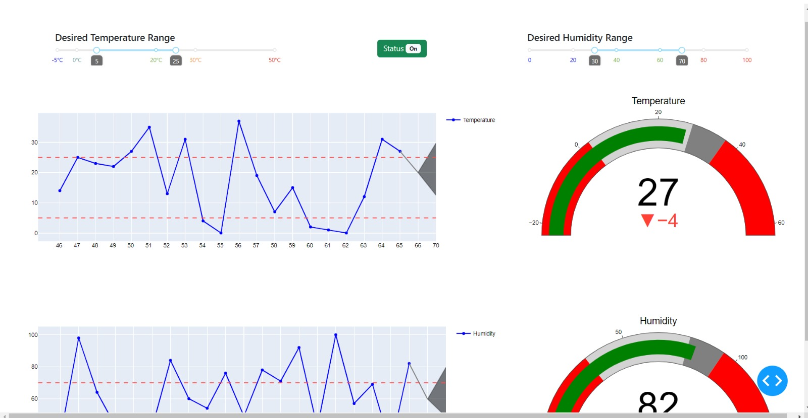
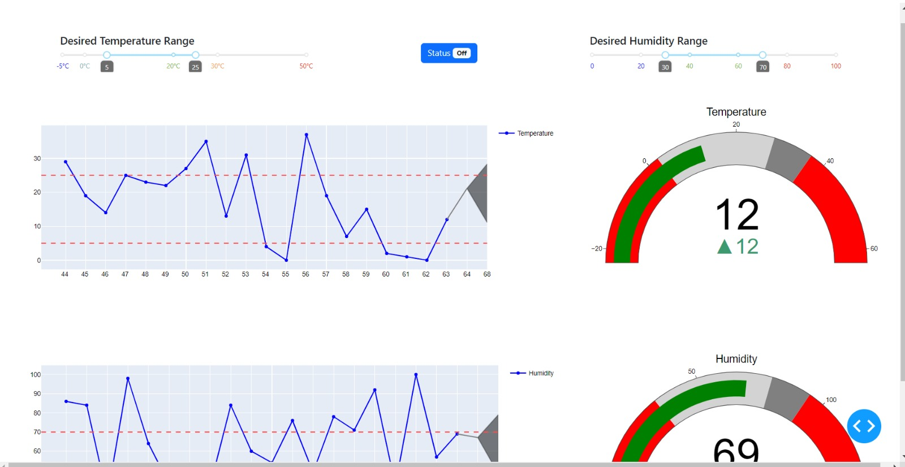
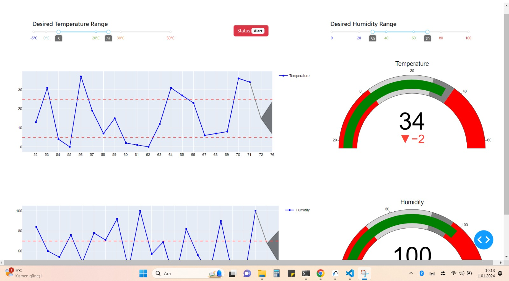

# air_conditioning_iot_system

An IoT system that reads temperature and humidity from the sensor (Raspberry Pi is used) and sends to the socket (uses C++). Python based server listens the socket and updates the database when new data arrives.  
For the web application side, the user is allowed to set desired temperature and humidity range. If the humidity or temperature goes out of the given value range, the air conditioner status becomes "ON" (fig 1) otherwise "OFF" (fig 2). There is also a dynamic anomaly detection system (uses previous N value to set anomaly thresholds). If any value touches the anomaly threshold, air conditioner status becomes "ALERT" (fig 3). The system also contains a basic forecasting feature to predict following 5 steps.

